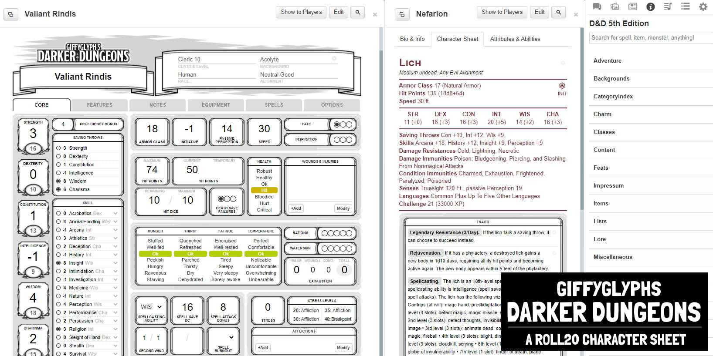

# Changelog

## v2.2.0
* Added open skills to PC sheet.
* Fixed NPC reactions bug: Reactions now display correctly.
* Can now edit equipment quantity/slots/notches directly on the equipment panel.
* Containers can now add extra inventory slots.
* Items can now be marked as carried-but-not-equipped.
* Feature details can now be hidden/condensed.
* Currency names can now be changed.
