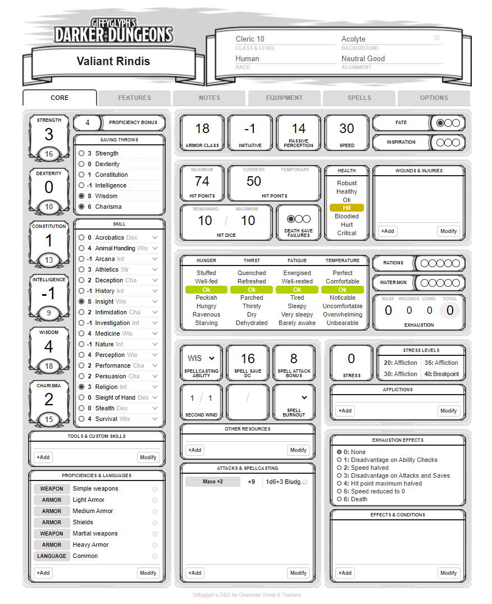

# Foundry Quick Quest

Want to play [Giffyglyph's Darker Dungeons](https://github.com/giffyglyph/giffyglyphs-darker-dungeons) in [Roll 20](https://roll20.net/)? No worries—**Giffyglyph's Roll20 Darker Dungeons** has you covered with a new, fully-featured character sheet!

## Features

* A new character sheet and NPC sheet.
* 6 carefully laid-out tabs, panels, and options.
* Full compatibility with any D&D 5e game.
* Wounds, survival conditions, and stress.
* Easy equipment tracking using either weight or inventory slots.
* Options to toggle individual DARKER DUNGEONS modules on and off.
* Full drag-and-drop compendium support.
* NPC support.
* And more.

## Getting Started

To use this character sheet in your Roll20 D&D 5e game, search for **D&D 5e (Darker Dungeons)** in the roll20 sheet list.

## Code Contributions

This project contains source code and build scripts to generate both development and live sheet code. If you'd like to try out some code changes and contributions—or customise the sheet for your own bespoke game—read the following:

### Requirements

1. Node.js (https://nodejs.org/en/).
2. gulp-cli (https://gulpjs.com/docs/en/getting-started/quick-start/)

### Instructions

1. Run "npm install" to install all the required node_modules.
2. Run "gulp" to build the dev/live sheets from source and automatically watch for any file changes.
3. To test locally: open _dist/dev/darker-dungeons.html_.
4. To upload to Roll20: copy _dist/live/darker-dungeon.css_ and _dist/live/darker-dungeon.html_ to Roll20.

## Roadmap

To see what's being worked on right now—and what may be planned for the future—check out the **[projects board](https://github.com/giffyglyph/roll20-5e-darker-dungeons/projects)**.

## Bugs and Feature Suggestions

If you notice a bug or have a feature suggestion, visit the **[issue board](https://github.com/giffyglyph/roll20-5e-darker-dungeons/issues)** and open a ticket. Please make sure to be as thorough as possible in your report and attach screenshots where appropriate, as low-effort tickets may be closed out-of-hand.

## Support

If you'd like to see more from this module in future, please consider [becoming a patron](https://www.patreon.com/giffyglyph). You can also find more of my work at:

* [giffyglyph.com](https://giffyglyph.com)
* [twitter](https://twitter.com/giffyglyph)
* [twitch.tv/giffyglyph](https://twitch.tv/giffyglyph)

## Licensing

This work is licensed under a [Creative Commons Attribution-NonCommercial-ShareAlike 4.0 International License](http://creativecommons.org/licenses/by-nc-sa/4.0/).